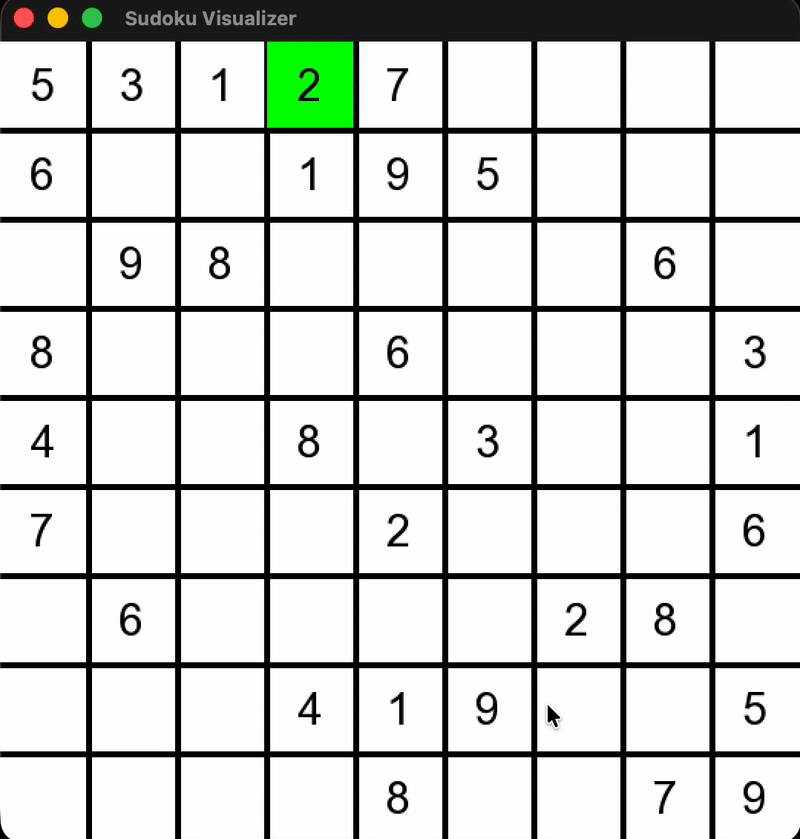

# Sudoku Solver Visualizer

  


A high-performance, real-time visualization of the **Backtracking Algorithm** solving Sudoku puzzles. This project demonstrates how recursive Depth-First Search (DFS) navigates constraints to find a solution, visualized using the SFML graphics library.

---

## 🎥 Demo



> **Visual Guide:**
> * 🟩 **Green Cells:** The algorithm is tentatively placing a number (Trying 1-9).
> * 🟥 **Red Cells:** A dead-end is reached (Backtracking to fix the previous error).

## 🚀 Features

* **Algorithmic Visualization:** See the "brain" of the computer working in real-time.
* **Smart Backtracking:** Implements the classic recursive strategy with constraint checking (Row, Column, 3x3 Box).
* **Interactive Start:** The solver waits for user input (`Space Bar`) to begin.
* **Cross-Platform:** Optimized for **macOS Apple Silicon (M1/M2)** but compatible with Windows and Linux.

## 🛠️ Technical Overview

The core logic uses a **Recursive Backtracking** approach:

1.  **Search:** Find the first empty cell (represented by 0).
2.  **Try:** Attempt to place numbers `1` through `9`.
3.  **Validate:** Check if the number is safe using the `isSafe()` helper function.
4.  **Recurse:** If safe, move to the next cell.
5.  **Backtrack:** If no number fits, reset the cell to 0 (Visualized in Red) and return to the previous step.

## ⚙️ How to Build & Run (macOS M1/M2)

This project requires **C++** and **SFML**.

### 1. Install SFML
Using Homebrew:
```bash
brew install sfml
```
### 2. Compile
Since SFML is installed in `/opt/homebrew` on Apple Silicon, use this command to link the libraries:

```bash
g++ -std=c++17 main.cpp -I/opt/homebrew/include -L/opt/homebrew/lib -lsfml-graphics -lsfml-window -lsfml-system -o main
```
### 3. Run
```bash
./main
```
## ⌨️ Controls

| Key | Action |
| :--- | :--- |
| **SPACE** | Start the Visualization |
| **ESC** / **Close** | Exit the Application |

## 👨‍💻 Author

**Saiduzzaman Sojib**

* **GitHub:** [@saiduzzaman-sojib](https://github.com/saiduzzaman-sojib)
* **LinkedIn:** [Saiduzzaman Sojib](https://www.linkedin.com/in/saiduzzaman-sojib/)
